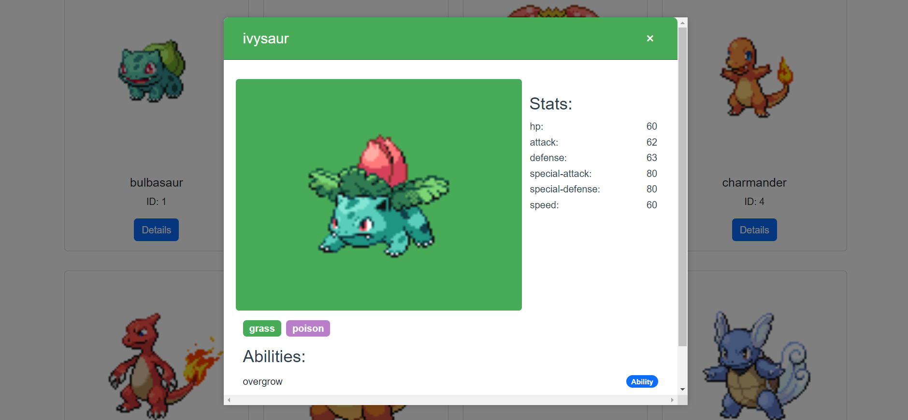

# Vue.js Pokedex Project

This is a simple Vue.js project that simulates a Pokedex, allowing you to search for Pokemon by name and filter them based on their type.



## Getting Started

1. Clone this repository to your local machine.

     ```bash
    git clone https://github.com/rizkyari/pokedex
    ```
2. Install the dependecies

    ```bash
    yarn install

    or

    npm install
    ```

3. Start the project

    ```bash
    yarn serve
    
    or

    npm run serve
    ```

## Technologies Used

- Vue 3
- Pinia (State Management)
- Axios (HTTP Requests)
- Bootstrap (Styling)
- Vue Test Utils & Jest (Unit Testing)
- ESLint (Linting)

## Project Structure

- `src/components`: Contains Vue components used in the project.
- `src/constants`: Stores project constants, such as API URLs or types.
- `src/store`: Houses the Pinia store for state management.
- `src/utils`: Includes utility functions or helper scripts.
- `src/views`: Contains the main views or pages of the application.
- `App.vue`: The main application component.
- `main.js`: The entry point of the application.

## Features

- Search for Pokemon by name.
- Filter Pokemon based on their type.
- Display detailed information about each Pokemon.

## How To Use
- Use the search box to find Pokemon by name.
- Click on a Pokemon to view detailed information.
- Use the filter options to filter Pokemon by type.

## Run Tests
This project includes unit tests for components using Vue Test Utils and Jest. To run the tests:

```bash
npm run test
```

## Code Quality
This project uses ESLint for code quality. To lint your code:

```bash
npm run lint
```

## License
This project is open-source and available under the MIT License.